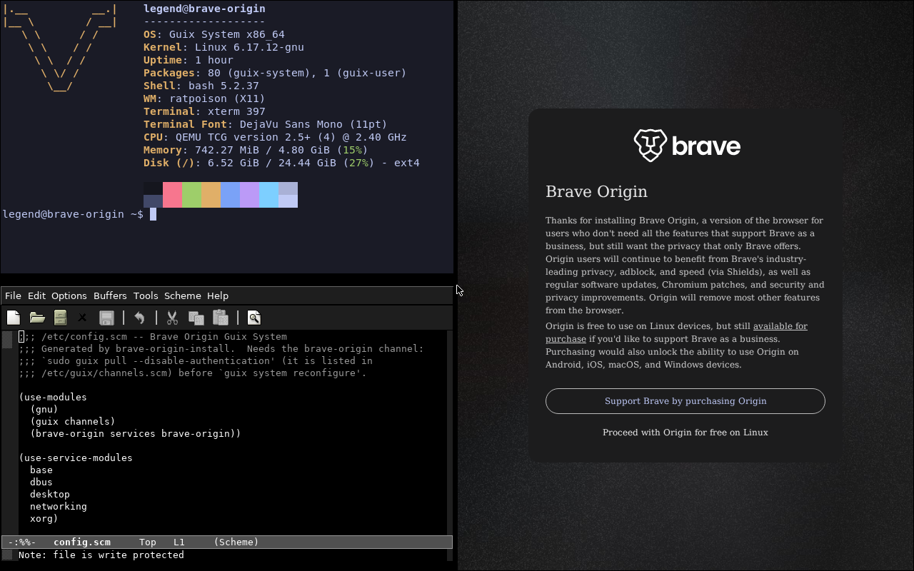

# Brave-origin-guix

Brave Origin (nightly) browser, packaged as a [GNU Guix](https://guix.gnu.org) channel.

Nix counterpart: [brave-origin-nix](https://github.com/legendarymsr/brave-origin-nix)



---

## Add the channel

Put this in `~/.config/guix/channels.scm`, then run `guix pull`:

```scheme
(cons (channel
        (name 'brave-origin)
        (url "https://github.com/legendarymsr/Brave-origin-guix")
        (branch "main"))
      %default-channels)
```

> **Note:** Guix will warn that it cannot authenticate this channel (no channel introduction yet). That is expected.
>
> The `(brave-origin …)` modules below are only available **after** `guix pull` completes with this channel configured.

---

## Path A — Just add Brave Origin to an existing install

After `guix pull`:

```sh
guix install brave-origin-nightly
```

Or without installing:

```sh
guix shell brave-origin-nightly -- brave-origin
```

Try it directly without touching your channels file:

```sh
guix time-machine -C README.scm -- shell brave-origin-nightly -- brave-origin
```

### As a Guix System service

Installs the browser and sets up the setuid `chrome-sandbox` automatically:

```scheme
(use-modules (brave-origin services brave-origin))

(operating-system
  ...
  (services (cons (service brave-origin-service-type)
                  %desktop-services)))
```

### As a Guix Home service

```scheme
(use-modules (brave-origin home services brave-origin))

(home-environment
  (services
   (list (service home-brave-origin-service-type
                  (home-brave-origin-configuration
                   (default-browser? #t)
                   (extensions '("cjpalhdlnbpafiamejdnhcphjbkeiagm"))
                   (command-line-arguments '("--force-dark-mode")))))))
```

| Option | Default | Description |
|---|---|---|
| `default-browser?` | `#f` | Register as default browser via XDG |
| `extensions` | `'()` | List of extension IDs to pre-install |
| `command-line-arguments` | `'()` | Extra flags passed to the binary |

---

## Path B — Fresh Guix system setup

Browser + tiling WM ([Ratpoison](http://www.nongnu.org/ratpoison/)) + editor (Emacs), declaratively.

> **Requires `guix pull`** with the channel configured (Path A, Step 0) before these modules are available.

### System config (`/etc/config.scm`)

```scheme
(use-modules (brave-origin services brave-origin))

(operating-system
  ...
  (services (cons (service brave-origin-service-type)
                  %base-services)))
```

### Home config (`~/.config/guix/home.scm`)

```scheme
(use-modules (brave-origin home services brave-origin)
             (brave-origin home services emacs)
             (brave-origin home services ratpoison))

(home-environment
  (services
   (list (service home-brave-origin-service-type
                  (home-brave-origin-configuration
                   (default-browser? #t)))
         (service home-emacs-simple-service-type)
         (service home-ratpoison-service-type))))
```

Then apply:

```sh
sudo guix system reconfigure system.scm
guix home reconfigure home.scm
```

---

## Ratpoison keybindings

Prefix key: `C-t`

| Binding | Action |
|---|---|
| `C-t b` | brave-origin |
| `C-t e` | emacs |
| `C-t t` | xterm |
| `C-t h/j/k/l` | focus left/down/up/right |
| `C-t H/J/K/L` | exchange frame left/down/up/right |
| `C-t s` | hsplit |
| `C-t v` | vsplit |
| `C-t w` | remove frame |
| `C-t Q` | only current frame |
| `C-t n/p` | next/prev window |
| `C-t q` | quit |
| `C-t r` | restart |

Add your own bindings via `(extra-lines '("bind x exec myapp"))` in `home-ratpoison-configuration`.

---

## Emacs

Dead-simple config: relative line numbers, no splash screen, no menu/tool/scroll bars, 2-space indent. Defaults to `emacs-no-x` (terminal). To use GUI Emacs:

```scheme
(service home-emacs-simple-service-type
         (home-emacs-simple-configuration
          (package emacs)))
```

---

## Sandboxing

`brave-origin` never runs with elevated privileges. The sandbox setup, in order of preference:

1. **setuid helper** — `chrome-sandbox` in `/run/privileged/bin`, set via `CHROME_DEVEL_SANDBOX`
2. **User namespaces** — Chromium's unprivileged namespace sandbox
3. **Fallback** — `--no-sandbox` with a warning on stderr (not recommended)

The Guix System service (`brave-origin-service-type`) handles the setuid helper automatically. See `security.scm` for the full security model.

---

## Updating

```sh
guix repl -- update.scm            # rewrites version + hash
guix repl -- update.scm --dry-run  # preview only
```

Then verify and commit:

```sh
guix build -L modules brave-origin-nightly
git commit -a -m "brave-origin-nightly: <old> -> <new>"
```

---

## Custom installer ISO

Build a bootable live ISO that boots straight into Ratpoison (SLiM autologin as
`guest`) with Brave Origin open, plus the one-command installer. Run from the
repository root so `-L modules` finds this channel:

```sh
guix system image -t iso9660 -L modules install.scm
```

Write to USB:

```sh
sudo dd if=$(guix system image -t iso9660 -L modules install.scm) \
         of=/dev/sdX bs=4M status=progress oflag=sync
```

Ratpoison prefix is `C-t`: `C-t b` Brave Origin, `C-t t` xterm. To install, open
an xterm and run `sudo brave-origin-install /dev/sdX`.
Installation templates are in `/etc/brave-origin-templates/` and the channel snippet is at `/etc/channels.scm`.

See `install.scm` for the full build instructions and step-by-step install guide.

---

## Repository layout

```
.guix-channel
modules/
  brave-origin/
    packages/brave-origin.scm      package definition
    services/brave-origin.scm      Guix System service
    home/services/
      brave-origin.scm             Guix Home service
      emacs.scm                    Guix Home service
      ratpoison.scm                Guix Home service
install.scm                        live (Ratpoison) + installer ISO
system.scm                         target operating-system declaration
home.scm                           home-environment declaration
update.scm                         version bumper
security.scm                       security model
docs.scm                           full source reference (Scheme)
README.scm                         docs + valid channels.scm
README.md                          this file
COPYING                            dual-license explanation
LICENSE                            GPL-3.0
LICENSE-MPL                        MPL-2.0
```

---

## License

Dual-licensed: **GPL-3.0-or-later** (preferred) and **MPL-2.0**.

GPL-3.0 is the preferred license — strong copyleft, ensures modifications stay open. MPL-2.0 is offered alongside it because this channel distributes the Brave Origin binary, which is MPL-2.0 (Brave Software, Inc.).

See [COPYING](COPYING) for the full explanation.

> Nothing here is legal advice. If you need FOSS legal advice, the [EFF](https://www.eff.org) may be able to help.
